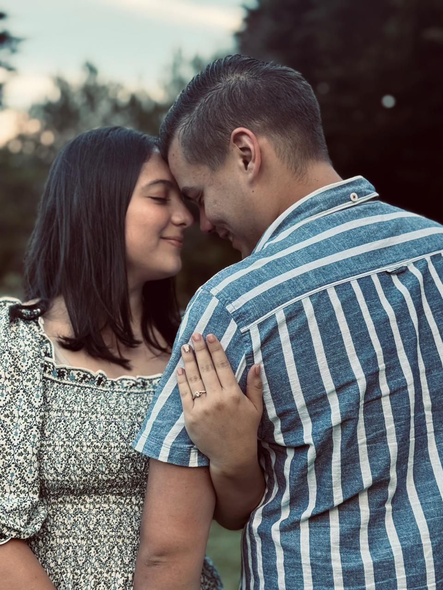
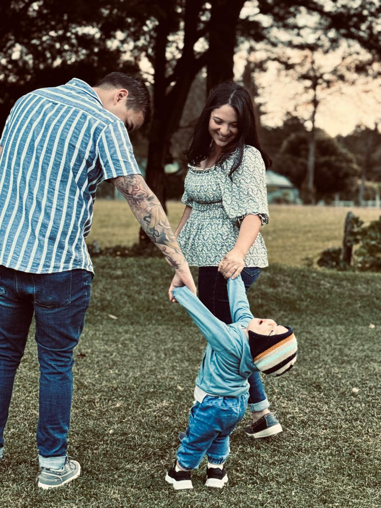

<!DOCTYPE html>
<html lang="es">
<head>
<meta charset="UTF-8">
<title>Nuestra Boda</title>
<meta name="viewport" content="width=device-width, initial-scale=1.0">

<link href="https://fonts.googleapis.com/css2?family=Playfair+Display:wght@500;700&family=Montserrat:wght@300;500&display=swap" rel="stylesheet">

</head>

<body>

<section>
  

    <h1>Nos Casamos</h1>
    
Desliza para acompañarnos en este momento ✨

    
  

</section>

<section>
  

    <h2>Keylor & Diana</h2>
    
Con mucha ilusión queremos compartir este día contigo

    
  

</section>

<section>
  

    
  

</section>

<section>
  

    <h2>11 · Abril · 2026</h2>
    

      
0<small>DÍAS</small>

      
0<small>HORAS</small>

      
0<small>MIN</small>

    

  

</section>

<section>
  

    <h2>La Celebración</h2>
    
Hacienda San José 4:00 PM

    <a href="https://maps.app.goo.gl/Ro9QHCggpEywDapT9" target="_blank">
      <button class="btn">Ver ubicación</button>
    </a>
  

</section>

<section>
  

    <h2>Confirma tu asistencia</h2>

    <!-- CONECTAR A GOOGLE FORMS -->
    <form action="https://docs.google.com/forms/d/e/TU_FORM_ID/formResponse" method="POST" target="_blank">
      <input name="entry.123456" placeholder="Nombre completo" required>
      <select name="entry.654321" required>
        <option value="">¿Asistirás?</option>
        <option>Sí, con gusto</option>
        <option>No podré asistir</option>
      </select>
      <button class="btn" type="submit">Enviar RSVP</button>
    </form>
  

</section>

<section>
  <footer class="reveal">
    Con cariño 💕 Keylor & Diana
  </footer>
</section>

</body>
</html
